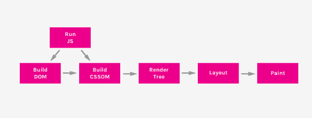
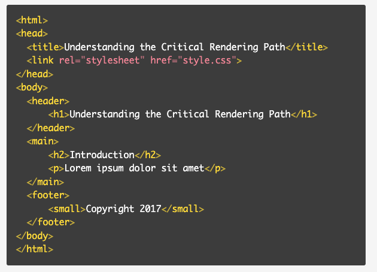
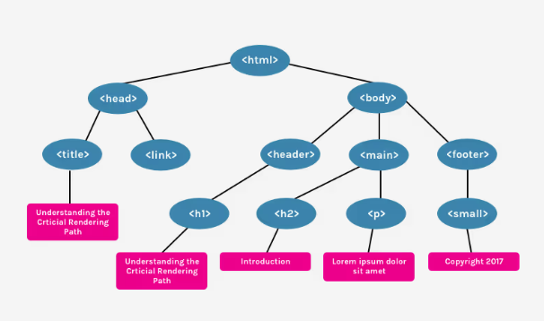
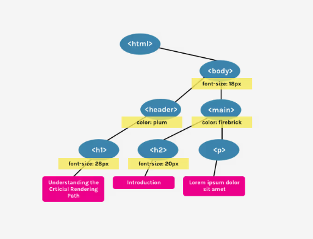

# Understanding the Critial Rendering Path

### Minha Sohn

---

# A Sequence of Critical Rendering Path (CRP)

1. Constructing the DOM Tree
2. Constructing the CSSOM Tree
3. Running JavaScript
4. Creating the Render Tree
5. Generating the Layout
6. Painting

---

# Constructing the DOM Tree

---

# Constructing the CSSOM Tree

**Render blocking resource**

- Render Tree cannot be constructed without fully parsed CSS resources.

**Script blocking**

- JavaScript files must wait until the CSSOM has been constructed.

`<link rel="stylesheet">` tag

---

# Running JavaScript

**parser blocking resource**

- parsing of the HTML document itself is blocked by JavaScript.
  `<script> tag`

---

# Creating the Render Tree

- A combination of both the DOM and CSSOM.
- A tree that represents what will be rendered on the page.
  

---

# Generating the Layout and Painting

- Determines what the size of the viewport.
  `<meta name="viewport" content="width=device-width,initial-scale=1">
`

- If no tag is provided, the default viewport is 980px.
- In the painting step, the visible content of the page can be converted to **pixels** to be displayed on the screen.
