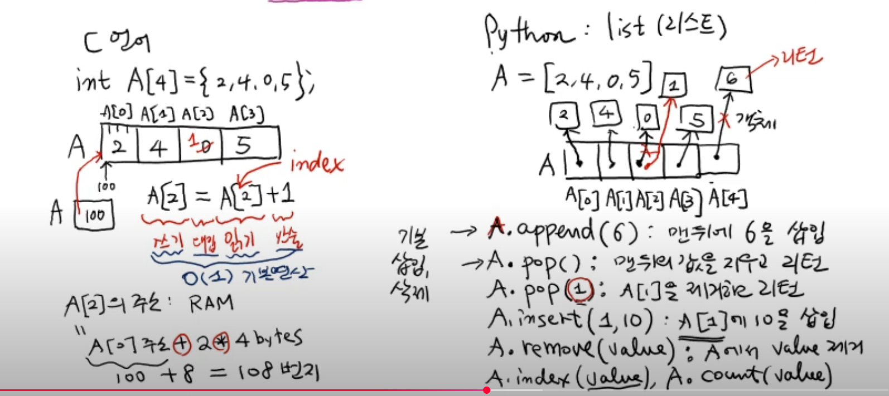
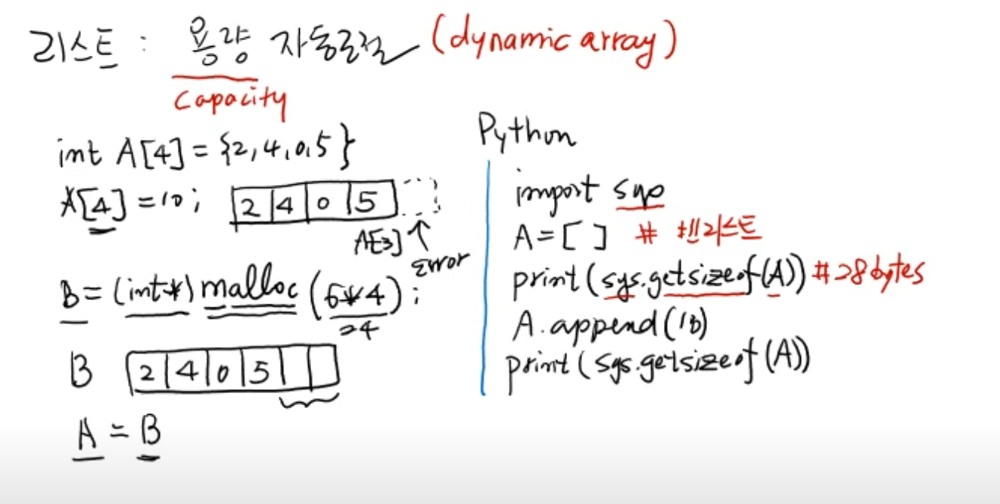

# 배열과 리스트

가장 기본적인 순차적인(sequential) 자료 구조

## 배열 (array) vs 리스트 (list)

### 배열 - C 언어

- C 언어는 배열에서 `연속된 메모리 블록` 그 자체이다.
- 따라서 배열에 새로운 값이 입력 되거나 수정되면, 해당 주소지에서 연산이 발생한다.
  - A[2] = A[2] + 1
  - A 배열의 2번째 인덱스 값을 읽어와 `+1` 더하는 연산을 수행하고, 그 값을 다시 A 배열의 2번째 인덱스 값에 쓰는 것
- 즉, 값이 변경되도 각 요소의 주소지는 변하지 않는다.

### 리스트 - 파이썬

- 파이썬에서 리스트는 `동적 배열 객체` 이다.
  - 즉, 각각의 요소는 각각의 객체로 구성되어 있다.
- 따라서 리스트에 새로운 값이 입력되거나 수정되면, 기존의 값은 해당 주소지에 존재하고, 새 값의 객체가 새로 생성되며, 리스트는 새로운 값의 주소지를 가르키게 된다.
  - A[2] = A[2] + 1
  - A[2] + 1 의 연산으로 새로 생성된 값은, 새 주소지에 저장된다.
  - A[2]의 기존 값은 그대로 존재하며, A[2]는 새 값의 주소지를 가르킨다.

#### 파이썬의 불변 객체와 참조 모델

- 파이썬의 모든 값은 **객체** 이다. (숫자, 문자열, 리스트, 함수까지 전부)
- 변수는 `객체 그 자체`가 아니라 객체를 가르키는 이름표 (참조) 역할을 한다.

**불변(immutable) vs 가변(mutable)**
불변 객체
- 한 번 만들어지면 내부 값을 바꿀 수 없는 객체 (`int`, `float`, `str`, `tuple` 등)
- 연산 시: 새로운 객체를 생성 -> 참조 객체를 변경

가변 객체
- 내부 값이 바뀔 수 있는 객체 (`list`, `dict`, `set` 등)
- 연산 시: 같은 객체의 내부 값이 변경 -> 참조 객체 유지

## 용량(capacigy) 자동 조절

- 배열은 이미 정해진 메모리안에 값이 들어 있기 때문에, 배열의 요소를 추가한다면 메모리 할당 함수 (malloc)를 사용해서 새로운 변수에 메모리를 추가한 배열을 다시 만들어야한다.
- 리스트는 `dynamic array`를 지원하기 때문에, 메서드를 이용하여 리스트에 새로운 값을 추가하거나 삭제하면 자동으로 해당 리스트의 메모리를 추가하고 삭제한다. 

### `List class`