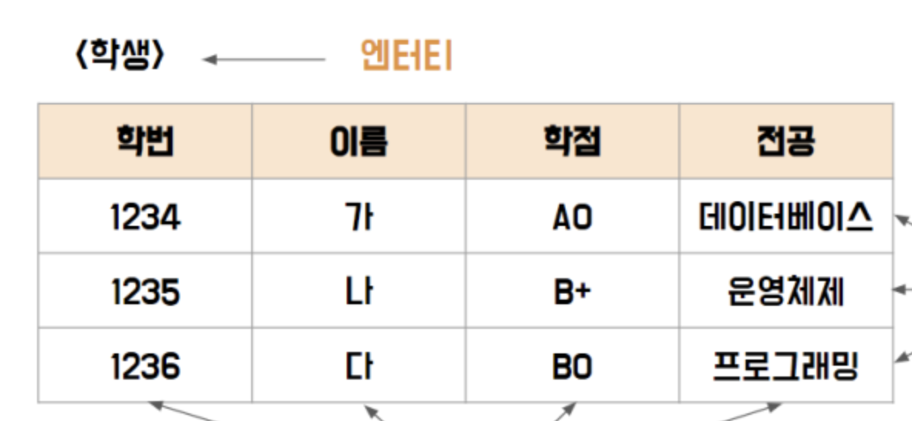
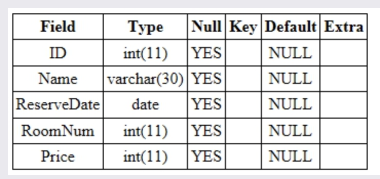
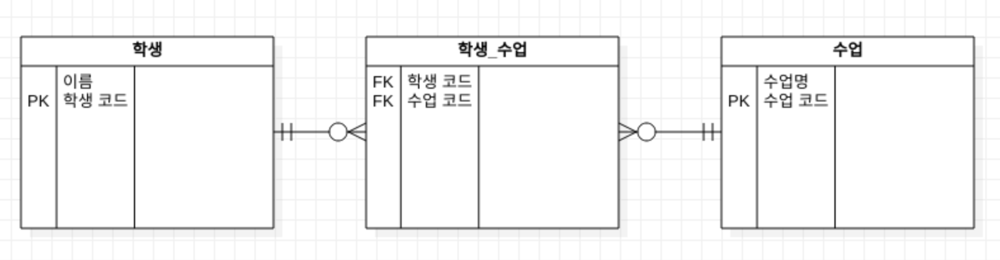
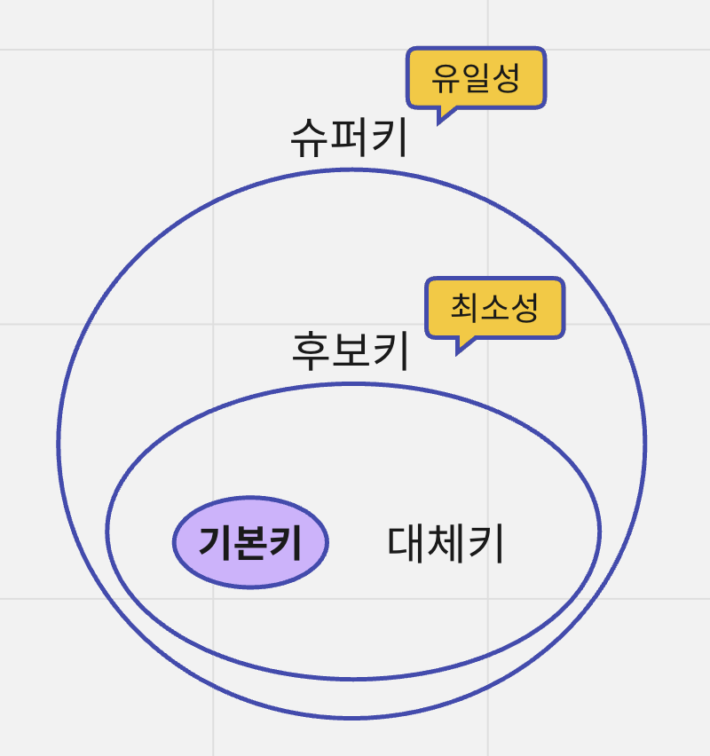
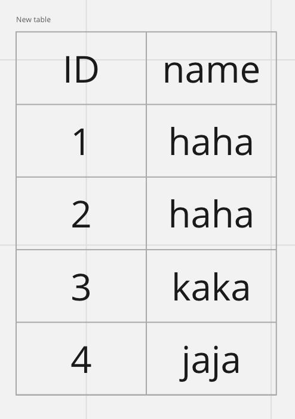
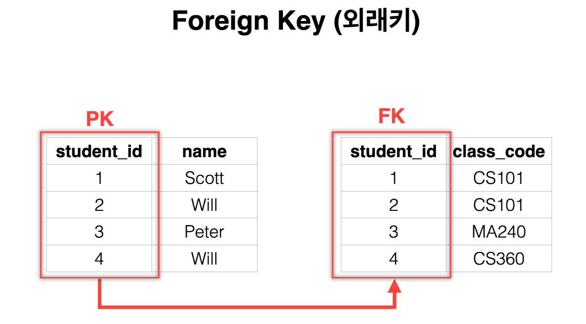

## Section 4.1 데이터베이스의 기본

- **데이터베이스는** 일정한 규칙, 혹은 규약을 통해 구조화되어 저장되는 데이터의 모음입니다.
- **DBMS**(DataBase Management System)은 데이터베이스를 제어, 관리하는 통합 시스템을 말합니다. 우리가 흔히 얘기하는 mysql, mongoDB 등이 이에 해당합니다.
- **쿼리 언어**(Query Language)는 데이터베이스 안에 있는 데이터들을 쿼리 언어를 통해 삽입, 삭제, 수정, 조회 등을 수행할 수 있다. SQL이 이 쿼리언어에 해당합니다.

### 4.1.1 엔티티

**엔티티는** 사람, 장소, 물건, 사건, 개념 등 여러 개의 속성(attribute)을 지닌 명사를 의미합니다. 예를 들어 회원이라는 엔티티가 있다면, 회원은 이름, 아이디, 주소, 전화번호의 속성을 가집니다.

#### 약한 엔티티와 강한 엔티티

A가 혼자서는 존재하지 못하고 B의 존재 여부에 따라 종속적이라면

- A는 약한 엔티티이고, B는 강한 엔티티가 됩니다.
- 예를 들어, 방은 건물안에만 존재할 수 있기 때문에 방은 약한 엔티티이고, 건물은 강한 엔티티라고 할 수 있습니다.

### 4.1.2 릴레이션

**릴레이션(relation)**은 데이터베이스에서 정보를 구분하여 저장하는 기본 단위입니다. 엔티티에 관한 데이터를 데이터베이스는 릴레이션 하나에 담아서 관리합니다.

릴레이션은 관계형 데이터베이스에서는 *테이블*이라고 하며, NoSQL 데이터베이스에서는 *컬렉션*이라고 합니다.

#### 테이블과 컬렉션

데이터베이스의 종류는 크게 관계형 데이터베이스와 NoSQL 데이터베이스로 나눌 수 있습니다.

- 대표적인 관계형 데이터베이스인 MySQL의 구조는 레코드-테이블-데이터베이스로 이루어져 있습니다.
- NoSQL 데이터베이스인 MongoDB의 구조는 도큐먼트-컬렉션-데이터베이스로 이루어져 있습니다.

### 4.1.3 속성

**속성(attribute)**는 릴레이션에서 관리하는 구체적이며 고유한 이름을 갖는 정보입니다. 예를 들어 '차'라는 엔티티에는 차 번호, 바퀴 수, 색깔 등이 있습니다. 이 중에서 *서비스의 요구 사항*을 기반으로 관리해야 할 필요가 있는 속성들만 엔티티의 속성이 됩니다.

### 4.1.4 도메인

**도메인(domain)**이란 릴레이션에 포함된 각각의 속성들이 가질 수 있는 값의 집합을 말합니다. 예를 들어 성별이라는 속성이 있다면 이 속성이 가질 수 있는 값은 남, 여 라는 집합이 됩니다.

### 4.1.5 필드와 레코드

- 학생이라는 엔티티는 major이라는 테이블에 존재합니다.
- **필드**로는 학번, 이름, 학점, 전공을 가집니다.
- 이 테이블에 쌓이는 행(row) 단위의 데이터를 **레코드 또는 튜플**이라고 합니다.

#### 필드 타입

필드는 타입을 가집니다.

##### 숫자 타입

| 타입     | 용량(바이트) |
| --------- | ------------ |
| TINYINT   | 1            |
| SMALLINT  | 2            |
| MEDIUMINT | 3            |
| INT       | 4            |
| BIGINT    | 5            |

##### 날짜 타입

###### DATE

날짜 부분은 있지만 시간 부분은 없는 값에 사용됩니다. (년도, 월, 일) 3 바이트의 용량을 가집니다.

###### DATETIME

날짜 및 시간을 모두 포함하는 값에 사용됩니다. 8 바이트의 용량을 가집니다.

###### TIMESTAMP

날짜 및 시간을 모두 포함하는 값에 사용되니다. 1970-01-01 00:00:01 에서 2038-01-19 03:14:07까지 지원합니다. 4 바이트의 용량을 가집니다.

##### 문자 타입

###### CHAR와와 VARCHAR

CHAR와 VARCHAR 모두 그 안에 수를 입력해서 몇 자까지 입력할지 정할 수 있습니다.

- CHAR는 고정 길이 문자열이며 0에서 255 사이의 값을 가집니다. 예를 들어 CHAR(100)으로 선언한 후 10글자를 저장해도 100바이트로 저장됩니다.
- VARCHAR는 가변 길이 문자열 입니다. 길이는 0에서 65,535 사이의 값으로 저장할 수 있습니다. 예를 들어, 10글자의 이메일을 저장할 경우 10글자에 해당하는 바이트 + 길이기록용 1바이트로 저장하게 됩니다.

###### TEXT와 BLOB

두 개의 타입 모두 큰 데이터를 저장할 때 사용하는 타입입니다.

- TEXT는 큰 문자열 저장에 쓰며 주로 게시판 본문 등에 사용합니다.
- BLOB은 이미지, 동영상 등 큰 데이터를 저장할 때 사용합니다. 그러나 보통 AWS S3를 이용하는 등 서버에 파일을 올리고 파일에 관한 경로를 VARCHAR로 저장합니다.

###### ENUM과 SET

ENUM과 SET 모두 문자열을 열거한 타입입니다. 둘 다 공간적으로 이점을 볼 수 있지만 애플리케이션의 수정에 따라 각각에 정의한 목록을 수정해야한다는 단점이 있습니다.

- ENUM('x-small', 'small', 'medium', 'large', 'x-large') 형태로 쓰이며, ENUM 리스트에 없는 잘못된 값을 삽입하면 빈 문자열이 대신 삽입됩니다. 최대 65,535개의 요소들을 넣을 수 있습니다.
- SET은 ENUM과 비슷하지만 여러 개의 데이터를 선택할 수 있고, 비트 단위의 연산을 할 수 있으며 최대 64개의 요소를 집어넣을 수 있다는 점이 다릅니다.

### 4.1.6 관계

#### 1:1 관계

#### 1:N 관계

#### N:M 관계

학생은 여러 개의 강의를 들을 수 있고, 수업도 여러 명의 학생을 가질 수 있습니다. 이 경우 학생_수업이라는 케이블이 생성되어 1:N, 1:M이라는 관계를 갖는 테이블 두 개를 생성합니다.

### 4.1.7 키

테이블 간의 관계를 명확하게 하고 인덱스 사용을 위해 설정된 장치로 기본키, 외래키, 후보키, 슈퍼키, 대체키가 있습니다.

#### 기본키

**기본키(Primary Key)**는 유일성과 최소성을 만족하는 키입니다.

- 테이블의 데이터 중 고유하게 존재하는 속성이며 기본키에 해당하는 데이터는 중복되면 안됩니다.
- 따라서 ID는 기본키로 설정할 수 있습니다. {ID, name}이라는 복합키를 기본키로 설정할 수 있지만 그렇게 되면 최소성을 만족하지 않습니다.

기본키는 자연키와 인조키로 나뉩니다. 예를 들어 유저테이블을 만든다고 했을 때 주민등록번호, 이름, 성별 등의 속성이 있을 수 있습니다.

- **자연키**는 이 중 중복되는 값들을 제외하고 나면 남는 주민등록번호와 같은 값을 말합니다.
- **인조키**는 인위적으로 유저 아이디라는 값을 부여하는 것을 말합니다. mysql의 경우 auto_increment라는 값을 주어 인위적으로 유일성과 최소성을 부합하는 기본키를 생성합니다.

#### 외래키

**외래키(foreign key)**는 다른 테이블의 기본키를 그대로 참조하는 값으로 개체와의 관계를 식별하는 데 사용합니다. 외래키는 중복되어도 괜찮습니다.

#### 후보키

후보키(candidate key)는 기본키가 될 수 있는 후보들이며 유일성과 최소성을 동시에 만족하는 키입니다.

#### 대체키

대체키(alternate key)는 후보키가 두 개 이상일 경우 어느 하나를 기본키로 지정하고 남은 후보키들을 말합니다.

#### 슈퍼키

슈퍼키(super key)는 각 레코드를 유일하게 식별할 수 있는 유일성을 갖춘키 입니다.
