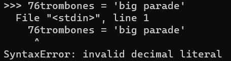
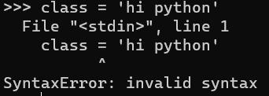
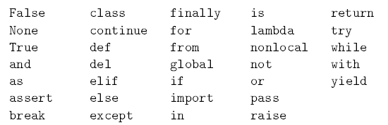
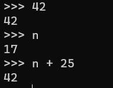
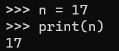
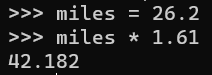
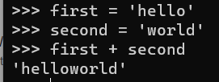
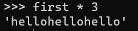

## Chapter2. Variable, expressions and statements

One of the most powerful features of a programming language is the ability to manipulate **variables**.

A variable is a name that refers to a value.

### 2.1 Assignment statements (선언문)

An assignment statement creates a new variable and gives it a value:

```
>>> message = 'And now for something completely different'
>>> n = 17
>>> pi = 3.1415926535897932
```

### 2.2 Variable names

Variable name should be meaningful as we document what the variable is used for. Here are gerall rule for naming variable:

- Can contain both letters and numbers, but can't begin with a number
- It's legal to use uppercase letters, but it's conventional to use only lower case
- The underscore character can be used
- Multuple words as variable name is allowed, such as `your_name`

If you give a variable an illegal name, you get a syntax error:



what's wrong with `class`?

It turns out that `class` is one of Python's keywords. The interpreter uses keywords to recognize the structure of the program, and they cannot be used as variable names.



### 2.3 Expressions and statements

#### 2.3.1 Expressions

An **expression** is a combination of values, variables, and operators.



When you type an expresson at the prompt, the interpreter **evaluates** it, which means that it finds the **value **of the expression.

#### 2.3.2 Statements

A **statement** is a unit of code that has an effect, such as creating a variable or displaying a value. It takes an action.



- The first line is an assignment statment that gives a value to `n`.
- The seconde line is a print statement that displays the value of `n`.

When you type a statement, the interpreter **executes** it, which means that it does whatever the statement says. In general, statements don't have values.

### 2.4 Script mode

- Interactive mode: you interact directly with the interpreter. It's a good way to get started, but if you work with more than a few lines of code, it can be messed.
- Script mode: run the interpreter to execute the script.

Python provides both modes, but there are differences between interactive and script mode:

In the interactive mode,

- The first line assign a value to miles, but it's not visible.
- The seconde line is a expression, so the interpreter evaluates it and displays the result.



However, in the script mode, if you run the same code above, but you get no output at all. Python will evaluate the expression, but it doesn't display the result. To display the result, you need a `print `statement:

```
miles = 26.2
print(miles * 1.61)
```

### 2.5 Order of Operations

When an expression contains more than one operator, the order of evaluation depends on the **order of operations**. Python follows mathematical convetion, PEMDAS.

- Parentheses
- Exponentiation
- Multiplication and Division have higher precedence than Addition and  Subtraction.
- Operators with the same precedence are evaluated from left to right.

#### 2.6 String Operations

In general, you can't perform mathematical operations on strings, however, there are two exceptions: + and *

- `+ operator` (String concatenation): it joins the strings by linking them end-to-end.



- `* operator`: it performs repetiton



### 2.7 Comments

As programs get bigger and more complicated, they get more difficult to read. Also, it is often difficult to look at a piece of code and figure out what it is doing, or why.

In this case, we can leave the notes called comments, and they start with the `# symbol`.

- Everything from the # to the end of the line is ignored - it has no effect on the execution of the program.
- Comments are useful when they document non-obvious feature of the code.

```
// useless
v = 5 # assign 5 to v

// contains useful information
v = 5 # velocity in meters/second.
```

### 2.8 Debugging

- Syntax Error
  - Syntax refers to the structure of a program and the rules about that structure.
  - If there is a syntax error anywhere in your program, Python displays an error message and quits, and you will not be able to run the program.
- Runtime Error
  - This errors does not appear until after the program has started running.
  - It also called **exceptions** because they usually indicate that something exceptional has happened.
- Semantic Error
  - This errors will run without generating error messages, but **it will do what you told it to do**.
  - Identifying semantic errors can be tricky because it requires you to work backward by looking at the output of the program and trying to figure out what it is doing.
-
