## Chapter 3. Functions

A function is a named sequence of statements that performs a computation.

### 3.1 Function calls

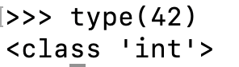

The name of the function in this case, is type.

The expression in parentheses is called the **argument** of the function. The reseult  for this function, is the type of the argument.

> It is common to say that a function `takes` an argument and `returns` a result. The result is also called the `return value`.

Python provides functions that convert values from one type to another.

- `int` function: can convert floating-point values to integers, but it doesn't round off.

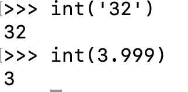

- `float` function: converts integers and strings to floating-point numbers.

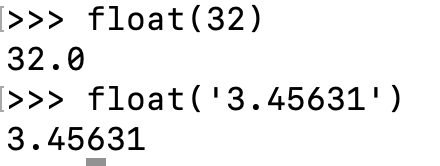

- str function: converts its argument to a string

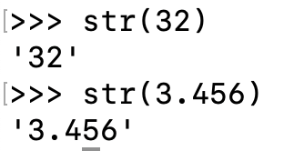

### 3.2 Math functions

Python has a math module that provides most of the familar mathematical functions.

- Module: a file that contains a collection of related functions.
  - The module object containes the functions and varilabes defined in the module.
  - To access one of the functions, you have to sepcify the name of the module and the name of the function, seperated by a dot.
  - This format is called **dot notation.**

### 3.3 Composition

One of the most useful features of programming languages is the ability to take small building blocks and **compose** them.

For example, the argument of a function can be any kind of expression, including arithmetic operators, and even function calls:

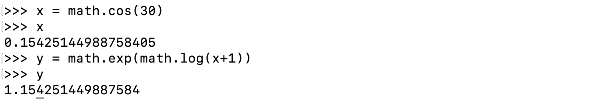

Almost anywhere you can put a value, you can put an arbitrary expression, with one exception: the left side of an assignment statement has to be a **variable** name. Any other expressiono n the left side is a syntax error.

### 3.4 Adding new functions

We have only been using the functions that come with Python, but it is also possible to add new functions.

**A function definition** specifies the name of a new function and the sequence of statements that run when the function is called.

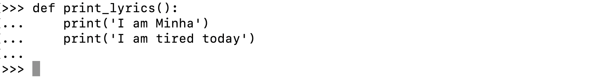

- `def`: a keyword that indicates that this is a function definition.
  - The name of the function is `print_lyrics`.
  - The rules for function names are the same as for variable names.
- The **empty parentheses** after the name indicate that this function doesn't take any arguments.
- The first line of the function definition is called the **header**, and the rest is called the **body**.
  - The header has to end with a colon and the body has to be indented.
  - By convention, indentation is always four spaces.
- The string in the print statements are enclosed in double quotes. Most people use single quotes.
- All quotation marks must be "straight quotes", not "Curly quotes".

Defining a function creates **a function object**, which ha s type `function`:

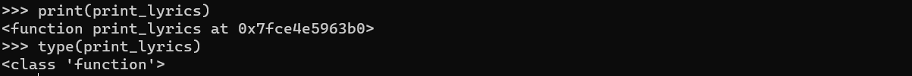

- It shows the address of the function where it saved in the memory.

The syntax for calling the new function is the same as built-in functions:

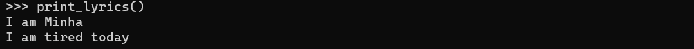

Once you have defined a function, you can call inside another function.

### 3.5 Definitions and uses

```
def print_lyrics():
    print('I am Minha')
    print('I am tired today')

def repeat_lyrics():
    print_lyrics()
    print_lyrics()

repeat_lyrics()
```

- Function definitions get executed just like other statements, but the effect is to creat function objects.
- The statements inside the function do not run until the function is called, and the function definition generates no output.
- The function definition has to run before the function get called.

As an exercise, what message will you get if you move the last line of this program to the top, so the function call appears before the definitions?

```
repeat_lyrics()

def print_lyrics():
    print('I am Minha')
    print('I am tired today')

def repeat_lyrics():
    print_lyrics()
    print_lyrics()
```

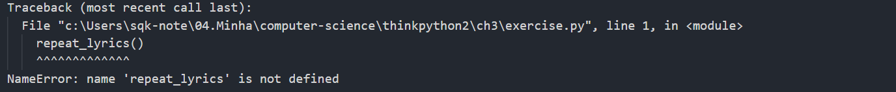

Now move the function call back to the bottom and move the definition of `print_lyrics` after the definion of `repeat_lyrics`. What happens when you run this program?

```
def repeat_lyrics():
    print_lyrics()
    print_lyrics()

def print_lyrics():
    print('I am Minha')
    print('I am tired today')

repeat_lyrics()
```

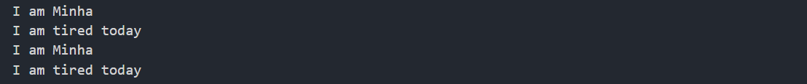

### 3.6 Flow of execution

- To ensure that a function is defined before its first use, you have to know order statements run in, which is called the **flow of execution**.
- **Execution always begins at the first statement of the program.** Statements are run one at a time, in order from **top to bottom**.
- Function definitions do not alter the flow of exectuion of the program, but remember that statements inside the function don't run until the function is called.
- A function call is like a *detour* in the flow of execution.
  - Instead of going to the next statement, the flow jumps to the body of the function, runs the statements there, and then comes back to pick up where it left off.
- What about the situation one function call another. While in the middle of one function, the program might have to run the statements in another function.
  - While in the middle of one function, the program might have to run the statements in another function.
  - Then, while running that new function, the program might have to run yet another function
  - In this case, Each time a function completes, Python picks up where it left off in the function that called it. When it gets to the end of the program, it terminates.

### 3.7 Parameters and arguments

Some of the functions we ahve seen require arguments, even takes two and more.

Inside the function, the arguments are assigned to variables called **parameters**. Here is a definition for a function that takes an argument:

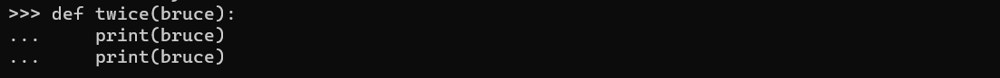

- This function assigns the argument to a parameter named bruce. When the function is called, it prints the value of the parameter twice.
- The same rules of composition that apply to built-in functions as well as programmer-defined functions.

The argument is evaluated befor ehte function is called, so in the examples the expression `'spam' * 2 `evaluated only once.

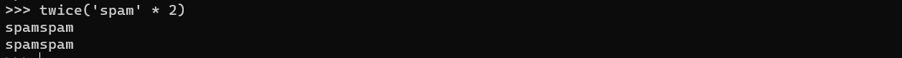

### 3.8 Variables and prarmetes are local

When you create a variable inside afunction, it is **local** , which means that is only exists inside the function.

When `cat_twice` terminates, the variable `cat` is destroyed. If we try to print it, we get an exception. Prarmeters are also local:

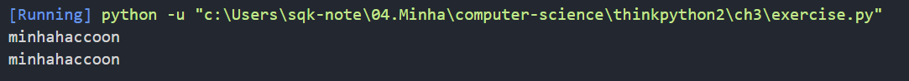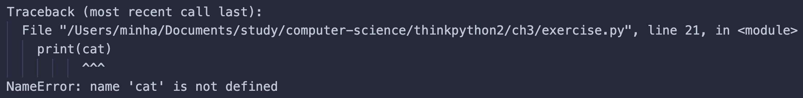

### 3.9 Stack diagrams

**Stack diagrams** show the value of each variable, but they also show the function each variable belongs to.

* Each function is represented by a **frame**. A frame is a box with the name of a function beside it and the parameters and variables of the function inside it.
* Each prameters refers to the same value as its corresponding argument.
* If an error occurs during a function call, Python prints the name of the function, the name of the function that called it, and the name of the function that called that, all the way back to `__main`.

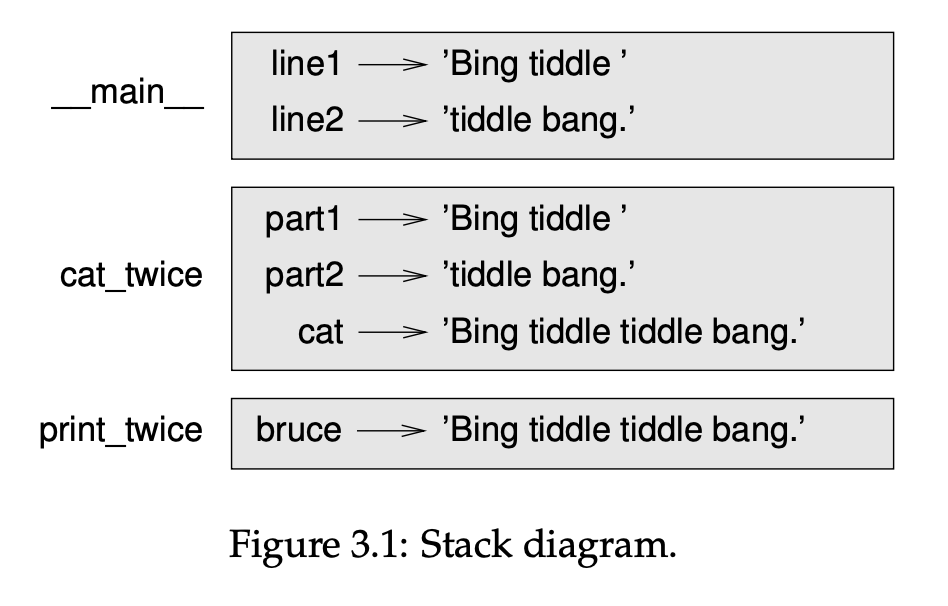

- For exampe, if you try to access cat from within print_twice, you get a `NameError`:

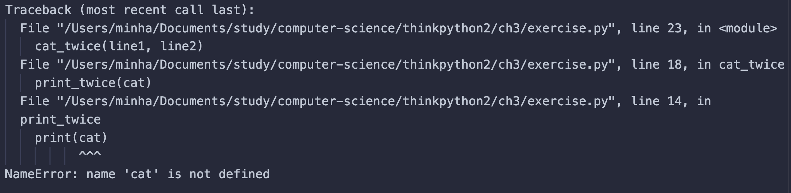

This list of functions is called a **traceback**.

- It tells you what program file the error occurred in, and what line, and what functions were executing at the time. It also shows the line of code that caused the error.
- The order of the functions in the traceback is the same as the order of the frames in the stack diagram.
- The function that is currently running is at the bottom.

### 3.10 Fruitful functions and void functions

- **Fruitful functions**: functions return a value, such as the math function.
- **Void functions**: functions don't return a value, such as the function only has print statement.

In interactive mode, calling a void function will still produce a return value, but this return value is not preserved when running the function in script mode.

### 3.11 Why functions?

Here are the reason why we divide a program into functions:

- Creating a function make a group of statements to **read and debug at ease**.
  - It allows you to debug the parts one at a time and then assemble them into a working whole.
- Fucntions can make a program smaller by eliminating **repetitive code.**
- Function can be **reused** anywhere you want.

### 3.14 Exercises

###### Exercise 3.1.

Write a function named `right_justify` that takes a string named `s` as a parameter
and prints the string with enough leading spaces so that the last letter of the string is in column 70 of the display.

```
>>> right_justify('monty')
```

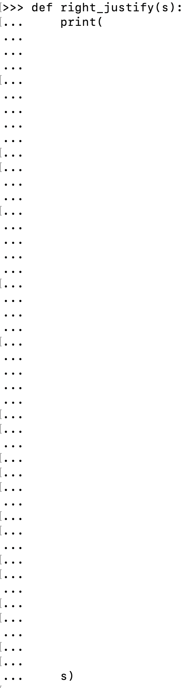

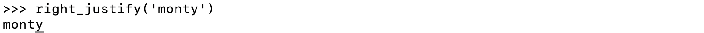

###### Exercise 3.2.

A function object is a value you can assign to a variable or pass as an argument. For example, `do_twice` is a function that takes a function object as an argument and calls it twice:

```
def do_twice(f):
    f()
    f()
```

Here’s an example that uses do_twice to call a function named print_spam twice.

```
def print_spam():
    print('spam')
```

```
do_twice(print_spam)
```


> 1. Type this example into a script and test it.

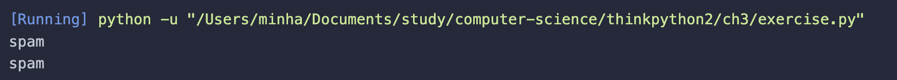

> 2. Modify `do_twice` so that it takes two arguments, a function object and a value, and calls the function twice, passing the value as an argument.

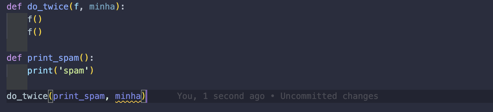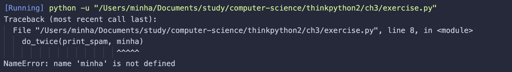

> 3. Copy the definition of `print_twice` from earlier in this chapter to your script.

> 4. Use the modified version of `do_twice` to call `print_twice` twice, passing 'spam' as an argument.

> 5. Define a new function called do_four that takes a function object and a value and calls the function four times, passing the value as a parameter. There should be only two statements in the body of this function, not four.

###### Exercise 3.3.

Note: This exercise should be done using only the statements and other features we
have learned so far.

> 1. Write a function that draws a grid like the following:

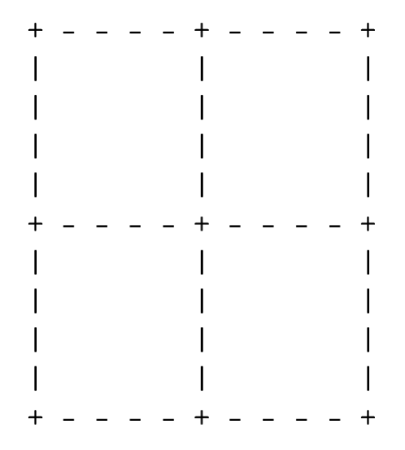
