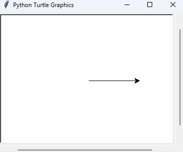

## Chapter 4. Case study: interface design

### 4.1 The turtle module

```
import turtle
bob = turtle.Turtle()
print(bob)
turtle.mainloop()
```

- When you run this code, it should create a new window with small arrow that represents the turtle.
- The `turtle` module provides a function called `Turtle` that creates a turtle object, and we assign to a variable named bob.
- print(bob) displays the memory address of Turtle object: `<turtle.Turtle object at 0x0000019B77C1AFD0>`
- `mainloop` function tells the window to wait fo r the user to do soemthing.

Once you create a Turtle, you can call **a method** to move it around the window. A method is similar to a function, but it uses different syntax.

```
bob.fd(100)
bob.bk(100)
```

- Calling a method is like making a request
  - method `fd`: you are asking bob to move forward.
  - method `bk`: move backward.
  - method `lt`: left turn.
  - method `rt`: right turn.
- The argument of fd is a distance in pixels, so the actual size depends on your display.



### 4.2 Simple repetition

We can do the same thing conciesly with a `for` statement.

- It similar to a function definition.
  - Header that ends with a colon and an indeted body.
  - The body can contin anynumber of statements.
- A `for` statement is also called a **loop** because the flow of execution runs through the body and then loops back to the top.

```
for i in range(4):
print('Hello!')
```

Using for statement, you can easliy fraw a square:

```
for i inrange(4):  
    bob.fd(100)  
    bob.lt(90)
```

### 4.3 Exercises

> 1. Write a function called `square` that takes a parameter named `t`, which is a turtle. It should use the turtle to draw a square.
>    Write a function call that passes bob as an argument to square, and then run the program again.

```
import turtle
bob = turtle.Turtle()

def square(t):
  for i in range(4):
    t.fd(100)
    t.lt(90)
  
square(bob) 
```

> 2. Add another parameter, named `length`, to `square`.
>    Modify the body so length of the sides is `length`, and then modify the function call to provide a second argument. Run the program again. Test your program with a range of values for length.

```
def square(t, length):
  for i in range(4):
    t.fd(length)
    t.lt(90)
  
square(bob, 100)
```

> 3. Make a copy of square and change the name to polygon. Add another parameter named n and modify the body so it draws an n-sided regular polygon. Hint: The exterior angles of an n-sided regular polygon are 360/n degrees.

```
def polygon(t, n, length):
  angle = 360 / n
  for i in range(4):
    t.fd(length)
    t.lt(angle)
  
square(bob, 7, 100)
```

> 4. Write a function called circle that takes a turtle, `t`, and radius, `r`, as parameters and
>    that draws an approximate circle by calling `polygon` with an appropriate length and
>    number of sides. Test your function with a range of values of `r`.
>    Hint: figure out the circumference of the circle and make sure that `length * n = circumference.`


### 4.4 Encapsulation

The fisrt exercise asks  you to put your square-drawing code into a function definition and then call the function, apssing the parameter.

```
def square(t):
    for i in range(4):
	t.fd(100)
	t.lt(90)

square(bob)
```

- Inside the function, t refers to the same turtle bob, so `t.lt(90)` has the same effect as `bob.lt(90)`.
- In that case, **why not call the parameter as bob**? The idea is that `t` can be any turtles, not just `bob`, so you could create another turtle and pass it as an argument to square:

```
alice = turtle.Turtle()
square(alice)
```

Wrapping apiece of code up in a function is called **encapsulation**.

- It attaches a name to the code, which serves as a kkind of documentation.
- It is useful when  you re-use the code, it is more concise to call a function twice than to copy and paste the body.

### 4.5 Generalization

Adding a parameter to a function is called **generalization** because it makes the function more general: now the square can be any size.

```
def square(t, length):
  for i in range(4):
    t.fd(length)
    t.lt(90)

square(bob, 100)
```

The next step is also a generalization.

```
def polygon(t, n, length):
  angle = 360 / n
  for i in range(n):
    t.fd(length)
    t.lt(angle)

polygon(bob, 7, 70)
```

When a function has more than a few numeric arguments, it is easy to forget what they are, or what order they should be in. It's called **keyword arguments** that include the parameter names as key-words.

- Keyword arguments make the program more readable.
- It also a reminder about how arguments and parameters work: when you call a function, *the arguments are assigned to the parameters*.

### 4.6 Interface design
