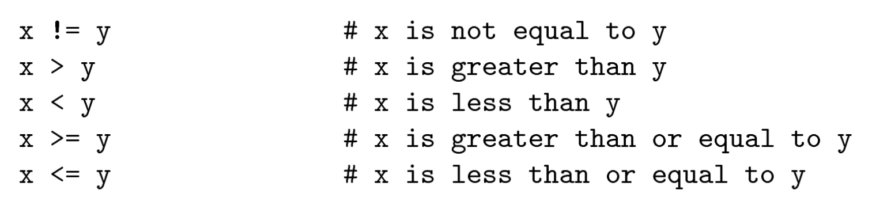

## Chapter 5. Conditionals and recursion

The main topic of this chapter is the if statement, which executes different code depending on the state of the program. However, here are two new operaters want to introduce: floor division and modulus.

### 5.1Floor division and modulus

- **Floor division operator (//)**: divides two numbers and rounds down to an integer.

  - For example, suppose the run time of a movie is 105 minutes. If you want to know how long is in hours. Conventional divison returns a floating-point number:

    ```
    minutes = 105
    minutes / 60 
    1.75
    ```
  - But we don't normally write hours with decimal points. Floor division return s the integer number of hours, rounding down:

    ```
    minutes = 105
    hours = minutes // 60
    1
    ```
  - To get the remainder, you could subtract off one hour in minutes:

    ```
    remainder = minutes - (hour * 60)
    remainder
    45
    ```
- **Modulus operator** (%): divides two numbers and returns the remainder.

  ```
  remainder = minutes % 60
  remainder
  45
  ```

  - The modulus operator is more useful than it seems. For example, you can check whether one number is divisible by another: if `x % y` is zero, then `x` is divisible by `y`.
  - Also, you can extract the right-most digit or digits from a number. For example, x % 10 yields the right-most digit of x (in base 10). Similarly x % 100 yields the last two digits.

### 5.2 Boolean expressions

**Boolean expression**: an expression that is either true or false.

- True and False are special values that beong to the type `bool`, not strings.
- The == operator is one of the relational operators; the orders are:



A common error is to use a single equal sign (=) instead of a double equal sign (==). Remember that `=` is an assignment operator and `==` is a relational operator.

### 5.3 Logical operators

There are three **logical operators**: `and`, `or`, and `not`.

- `n%2 == 0` or `n%3 == 0` is true if either or both of the conditions is true, that is, if the number is divisible by 2 or 3.
- The `not` operator negates a boolean expressions. (해당 boolean expression을 부정한다)
  - not (x >y) is true if x > y is false.

Strictly, the operands of the logical operators should be boolean expressions, but Python is not very strict. **Any nonzero number is interpreted** as `True`:

```
42 and True
>> True
```

This flexibility can be useful, but there are some subtleties to it that might be confusing.

### 5.4 Conditional execution

**Conditional statements**: ability to check conditions and change the behavior of the program accordingly. The simplest form is the if statement:

```
if x > 0:
    print('x is positive')
```

- The bollean expression after if is called the **condition**. If it is true, the indented statement runs. If not, nothing happens.
- **Compound statements**: if statements have the same structure as function definition. A header followed by an indented body.
  - No limit on the number of statements that can appear in the body, but there has to be at least one.
  - Occasionally, it is useful to have a body with no statements. In this case, you can use the *pass statement*, which does nothing.
    ```
    if x < 0
        pass
    ```

### 5.5 Alternative execution

**Alternative execution**: A second form of the if statement. there are two possibilities and the condition determines which one runs.

```
if x % 2 == 0:
    print('x is even')
else:
    print('x is odd')
```

- If the remainder when x is divided by 2 is 0, then we know that x is even, and the program displays an appropriate message.
- If the condition is false, the second set of statements runs.
- The alternatives are called **branches**, because they are branches in the flow of execution.

### 5.6 Chained conditionals

Sometimes there are more than two possibilities and we need more than two branches.

```
if x < y:
    print('x is less than y')
elif x > y:
    print('x is greater than y')
else:
    print('x and y are equal')
```

- **elif statement**: elif is an abbreviation of 'else if'.
  - There is no limit on the number of elif statement.
  - If there is an else clause, it has to be at the end, and must to have one at least.
- Each condition is checked in order.
  - If the first is false, the next is checked, and so on.
  - If one of them is true, the corresponding branch runs and the statement ends.
  - Even if more than one condition is ture, only *the first true* branch runs.

### 5.7 Nested conditionals

One conditional can also be nested within another. We could have written the exampel in the previous section like this:

```
if x == y:
    print('x and y are equal')
else:
    if x < y:
        print('x is less than y')
    else:
        print('x is greated than y')
```

The outer conditional containes two branches.

- The first branch containes a simple statement.
- The second branch containes another if statement, which has to branches of its own.

Although the indentation of the statements maeks the structure apparent, **nested conditionals** become difficult to read very quickly. It is a good idea to avoid them when you can.

For example, we can rewrite the following code using a single conditional:

```
if 0 < x:
    if x < 10:
        print('x is a positive single-digit number.')
```

The print statement runs only if we make it past both conditionals, so we can get the same effect with the and operator:

```
if 0 < x and x < 10:
    print('x is a positive single-digit number.')
```

For this kind of condition, Python provides a more concise option:

```
if 0 < x < 10:
    print('x is a positive single-digit number.')
```

### 5.8 Recursion

It is legal for one function to call another; it is also legal for a function to call itself. It may not be obvious why that is a good thing.

```
def countdown(n):
    if n <= 0:
        print('Blastoff!')
    else:
        print(n)
        countdown(n-1)
```

- If n is 0 or negative, it outputs the word 'Blastoff!'.
- Otherwise, it outputs n and then calls a function named `countdown`: passing n-1 as an argument.

What happens if we call this function like this? `countdown(3)`

- The execution of countdown begin with `n=2`, and since `n` is greater than 0, it outputs the value 2, and then calls itself.
- It will process the same thing over again until the `n=0`, since n is not greater than 0, it outputs the word, 'Blastoff!' and then returns.
  ```
  3
  2
  1
  Blastoff!
  ```

A function that calls itself is **recursive**; the process of executing it is called **recursion**.

For simple example like this, it is probably easier to use a `for` loop. But we will see examples later that are hard to write with a for loop and wasy to write with resursion.

### 5.9 Stack diagrams for recursive functions


Every time a function gets called, Python creates a frame to contain the function's local variables and parameters. For a recursive function, there might be more than one frame on the stack at the same time.

- As usual, the top of the stack is the fram for `__main__`. It is empty becuase we did not create any variable in `__main__` or pass any arguments.
- The four countdown frames have different values for the parameter n.
  - The bottom of the stack, where `n=0`, is called the **base case**.
  - It does not make a recursive call, so there are no more frames.

### 5.10 Infinite recursion

**Infinite recursion**: If a recursion never reaches a base case, it goes on making recursive calls forever, and the program never terminates.

```
def recurse():
    recurse()

RuntimeError: Maximum recursion depth exceeded
```

- In the most programming environments, a program with infinite recursion does not really run forever.
  - Python will reports an error message when the maximum recursion depth is reached.
  - When the error occurs, there are 1000 recurse frames on the stack.
- If you encounter an infinite recursion by accident, review the below cases:
  - Confirm that there is a base case that does not make a recursive call.
  - If there is a base case, check whether you are guaranteed to reach it.

### 5.11 Keyboard input

**`input` built-in function**: stops the program and waits for the user to type something. When the user presses `Return` or `Enter`, the program resumes and input returns what the user typed as a *string*.

```
name = input('what is your name? \n')
'Aurther, King of the Britons!'
```

- The sequence `\n` at the end of the prompt represents a **newline**, which is a special character that causes a line break.
- You can make the return value as an *integer*.

  ```
  prompt = 'how old are you?'
  speed = input(prompt)

  int(speed)
  ```
