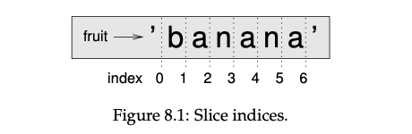
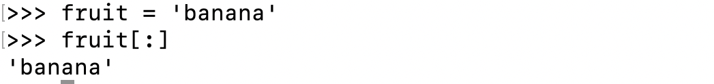

## Chapter 8. Strings

A string is a **sequence**, which means it is an ordered collection of other values.

### 8.1 A string is a sequence

A string is a sequence of characters. You can access the characters one at a time with the bracket operator:

> What is the sequence of string?
>
> In the context of strings and text, a "sequence" typically refers to **a contiguous or ordered arrangement of characters** within a string. It means that certain characters appear in a specific order, one after the other, forming a recognizable pattern or set of characters within the string.

```
fruit = 'banana'
letter = fruit[1]
```

The expression in brackets is called an **index**. The index indicates which character in the sequence you want.

- The index is an offset from the beginning of the string, and the offset of the first letter is zero.
- You can use an expression that containes variables and operators as index.

  ```
  >>> i = 1
  >>> fruit[i]
  'a'

  >>> fruit[i+1]
  'n'
  ```
- The value of the index has to be an integer.

### 8.2 `len`

len is a built-in function that returns the number of characters in a string:

```
>>> fruit = 'banana'
>>> len(fruit)
6
```

### 8.3 Traversal with a for loop

A lot of computations involve processing a string one character at a time. This pattern of processin g is called a **traversal**.

```
index = -1
while index >= - 6:
    letter = fruit[index]
    print(letter)
    index = index - 1
```

- This loop traverses the tstring and displayes each letter on a line by itself.
- As an exercise, write a function that takes a string as an argument and displays the letters backward, one per line.

  ```
  fruit = 'banana'

  index = -1
  while index >= - 6:
      letter = fruit[index]
      print(letter)
      index = index - 1
  ```

Another way to write a traversal is with a `for` loop:

```
for letter in fruit:
    print(letter)
```

Each time through the loop, the next character in the string is assigned to the variable letter. The loop continues until no characters are left.



### 8.4 String slices

A segement of a string is called a **slice**. Selecting a slice is similar to selecting a character:

```
s = 'Monty Python'
s[0:5] = 'Monty'
```

- The operator `[n:m]` returns the part of the string from the "n-eth" character to the "m-eth" character, including the first but *excluding the last*.
- This behavior is counterintuitive, but it might help to imagine the indices pointing *between* the characters.
- If you omit the first index (before the colon), the slice starts at the beginning of the string. If you omit the second index, the slice goes to the end of the string:

```
fruit = 'banana'
fruit[:3]
'ban'
```

- If the first index is greater than or equal to the second the result is an **empty string**, represented by two quotation marks.

> What do you think `fruit[:]` means? Try it and see.



### 8.5 Strings are immutable

It is tempting to use the [ ] operator on the left side of an assignemnt, with the intention of changing a character in a string. For example:

```
greeting = 'Hello, world!"
greeting[0] = 'J'

TypeError: 'str' object does not support item assignment
```

- The "object" in this case is the string and the "item" is the character you tried to assign.
- For now, an object is the same thing as a value, but we will refine that definition later in chapter 10.

The reason for the error is that strings are **immutable**, which means you can't change an existing string. The best you can do is create a new string that is a variation on the original.

### 8.6 Searching

```
def find(word, letter):
    index = 0
    while index < len(word):
	if word[index] == letter:
	    return index
	index = index + 1
    return -1
```

In a sense, `find` is the inverse of the [ ] operator. 

- Instaed of taking an index and extracting the corresponding character, it takes a character and finds the index where that character appears.
- If the character is not found, the function returns -1.

This is the first example we have seen of a `return` statement inside a loop. 

- If `word[index] == letter`, the function breaks out of the loop and returns immediately.
- If the character doesn't appear in the string, the program exits the loop normally and returns -1.

This pattern of computation is called a **search**, which is traversing a sequence and returning when we find what we are looking for.

### 8.7 Looping and counting

The following program counts the number of times the letter a appears in a string:

```
word = 'banana'
count = 0
for letter in word:
    if letter == 'a':
	count = count + 1

print(count)
```

This program demonstrates another pattern of computation called a **counter**.

- The variable `count` is initialized to 0 and then incremented each time an a is found.
- When the loop exists, `count` contains the result.

### 8.8 String methods

Strings prodvide methods that perform a variety of useful operations. 

A method is similar to a function - it takes arguments and returns a value, but the syntax is different.

For example, the method `upper` takes a sting and returns a new string with all uppercase letters. It uses the method syntax `word.upper()`.

- This corm of dot notation specifies the name of the method, upper, and the name of the string to apply the method to, word.
- The empty parentheses indicate that this method takes no arguments.

```
word = 'banana'
new_word = word.upper()
```

- A method call is called an **invocation**. In this case, we would say that we are invoking `upper` on `word`.

### 8.9 The `in` operator

The word in is a boolean operator that takes two strings and return `True` if **the first** appears as a substring in the second.

```
'a' in 'banana'
True
```

### 8.10 String comparision

The relational operators work on strings. They will putting words in **alphabetical** order.

```
word = 'apple'
if word < 'banana':
    print('Your word, ' + word + ', comes before banana.')
elif word > 'banana':
    print('Your word, ' + word + ', comes after banana.')
else:
    print('All right, bananas.')

Your word, apple, comes before banana.
```

- Python does not handle uppercase and lowercase letters the same way people do. All the *uppercase* letters come before all the lowercase letters.
