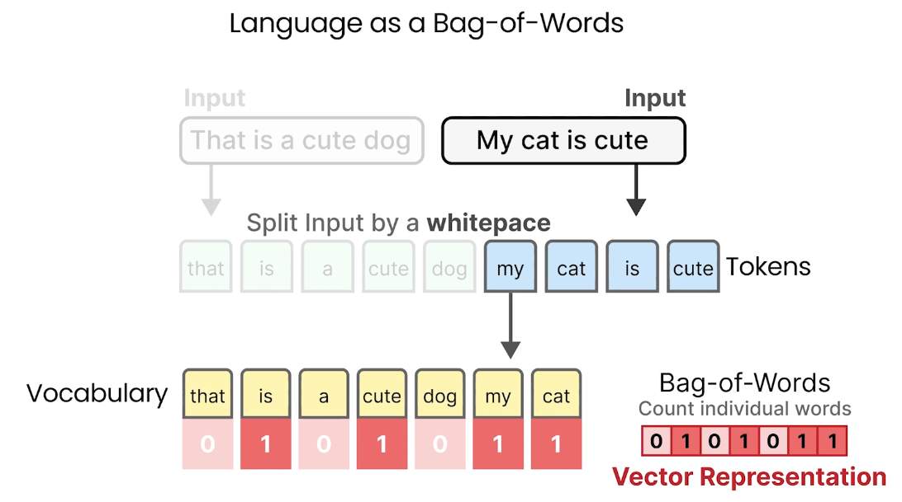

# BackOfWords

# Bag of Words

## Bag of Words(BoW)란?

- 자연어를 순서나 의미와 상관없이 단어 단위로 쪼개어(Tokenization) 각 단어의 빈도수를 세어 벡터로 표현하는 방법입니다.
- BoW는 문장이나 문서의 구조(문법, 순서 등)는 무시하고, 오직 단어가 등장했는지와 그 빈도만을 고려합니다.

### 프로세스

1. **Input**: 입력 문장을 준비합니다.
2. **Tokenization**: 입력 문장을 공백(whitespace) 기준으로 단어(토큰)로 분리합니다.
3. **Create Vocabulary**: 전체 데이터셋에서 등장하는 단어들의 집합(Vocabulary, 단어장)을 만듭니다.
4. **Vector Representation**: 입력 문장에 대해, Vocabulary에 있는 각 단어가 몇 번 등장했는지 세어 벡터로 만듭니다.

### 예시

- 입력: "My cat is cute"
- Vocabulary: [that, is, a, cute, dog, my, cat]
- 벡터 표현: [0, 1, 0, 1, 0, 1, 1]
  - 각 숫자는 해당 단어가 입력 문장에 등장한 횟수입니다.

### 용어 정리

- **Vocabulary(단어장)**: 학습 데이터셋을 기반으로 만든 단어들의 집합

---

핵심은, BoW는 문장의 의미나 순서를 고려하지 않고, 단어의 등장 여부와 빈도만을 벡터로 표현하는 아주 기본적인 자연어 처리 기법이라는 점입니다.
