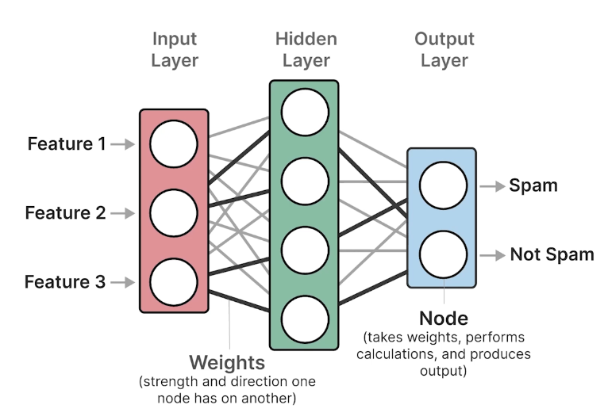
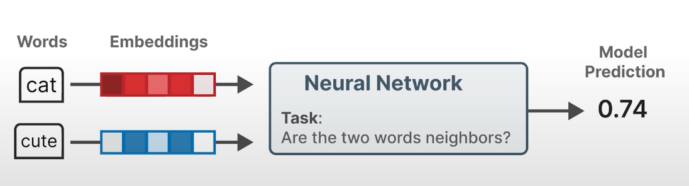
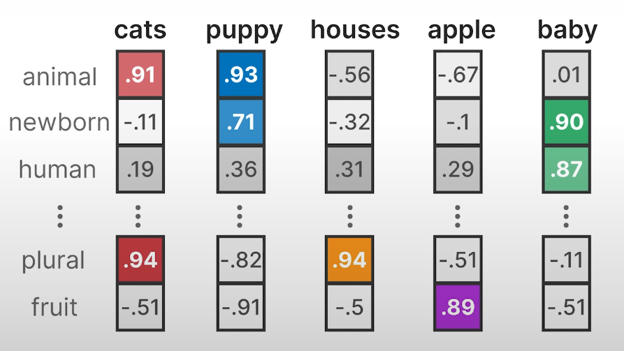
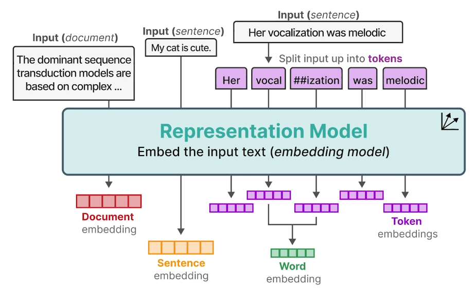

# Word2Vec와 Word Embedding 정리

## Word2Vec란?

- 2013년에 발표된 개념으로, 단어의 뜻을 파악할 수 없었던 Bags of Words와 달리 단어의 뜻과 관계를 파악할 수 있는 모델
- 단어의 뜻을 생성하기 위해 Neural Networks(신경망)를 사용
- Neural Networks는 여러 layer(층)로 구성되며, 각 layer는 다른 weight(가중치)를 가짐
- weight는 입력 데이터의 중요도를 조절하는 값(파라미터)이며, 경사하강법(gradient descent)으로 업데이트됨
- Node는 데이터를 받아 계산 후 다음 단계로 전달하는 작은 계산기 역할

---

## Word2Vec의 Embedding 원리

- Embedding된 Vocabulary(단어장)들을 Neural Networks로 비교하여, 각 입력 단어가 Vocabulary의 다른 단어들과 어떤 관계(거리)가 있는지 계산
- 단어들 간의 거리가 가까울수록(=연관성 높음) 주로 같이 문장에 많이 쓰임
- Word2Vec은 이 과정을 통해 각 단어의 관계를 학습하고, Embedding 값이 가까워지거나 멀어짐
- 결과적으로 Embedding에 단어의 의미가 저장됨

---

## Word Embedding과 차원(Dimension)

- Word Embedding: 단어를 컴퓨터가 이해할 수 있도록 숫자 벡터로 표현한 것(임베딩 벡터)
- 각 숫자는 -1에서 1 사이의 값으로 생성됨
- 임베딩 벡터의 길이(차원 수)는 보통 50~300차원 사용
- 각 단어는 고정된 길이의 벡터로 표현되며, 이 벡터의 구조(조합, 방향, 거리)를 통해 의미의 유사도를 파악할 수 있음(코사인 유사도 등)
- Word2Vec은 입력에 해당하는 단어의 벡터값을 생성하는 것이 아니라, 이미 학습된 단어들의 벡터값을 조회하는 개념임
- 모델에 없는 단어가 들어오면 OOV(Out-Of-Vocabulary) 문제가 발생

---

## 다양한 임베딩 종류와 Representation Model

- Word Embedding을 수행하는 모델을 Representation Model이라고 함
- 임베딩에는 Document, Sentence, Word, Token Embedding 등 다양한 수준이 있음
- 예시:
  - Document Embedding: 전체 문서를 하나의 벡터로 표현
  - Sentence Embedding: 문장 하나를 하나의 벡터로 표현
  - Word Embedding: 단어 단위 벡터
  - Token Embedding: 토큰 단위 벡터(서브워드 포함)
- Token Embedding을 평균내어 Word Embedding으로 만들 수 있음
- 학습할 단어 수를 줄이기 위해, 자주 나오는 부분(예: vocal, ##ization)으로 나누어 처리하면 새로운 단어도 유연하게 처리 가능

