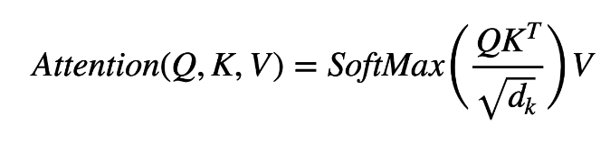
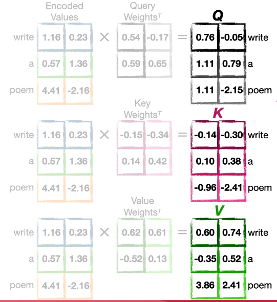
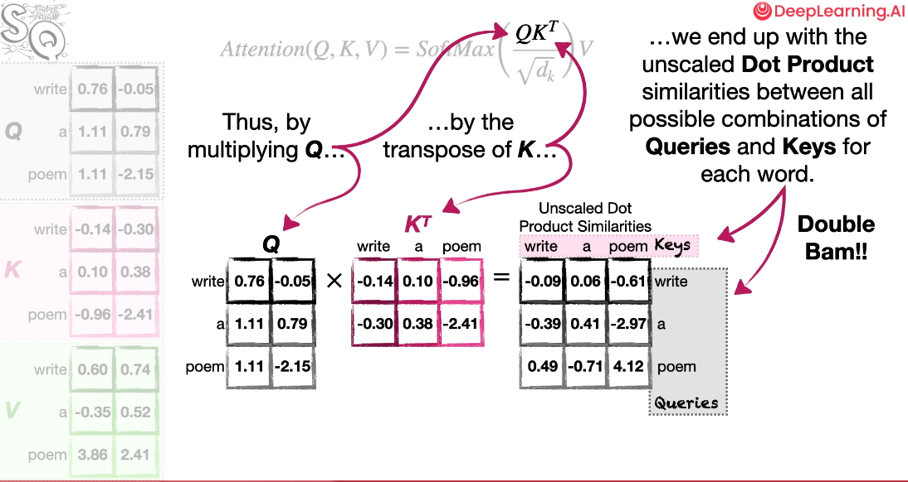
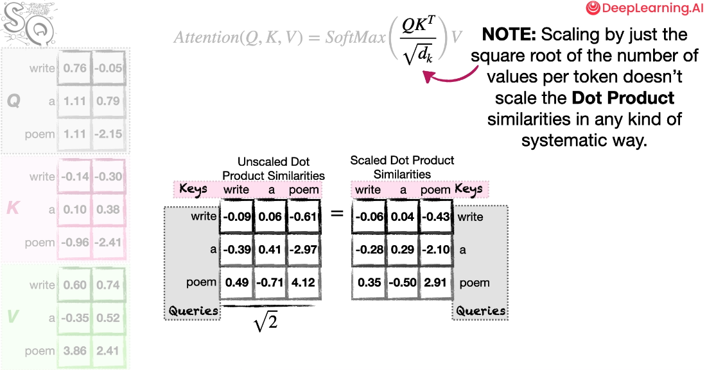
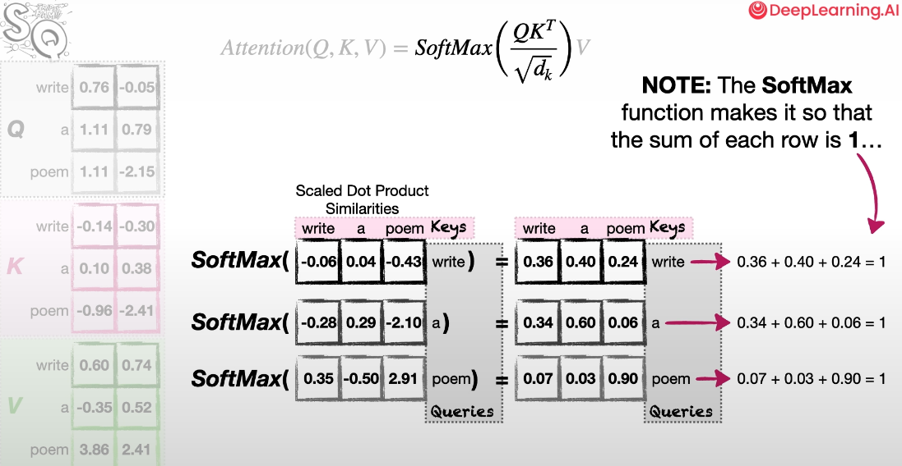
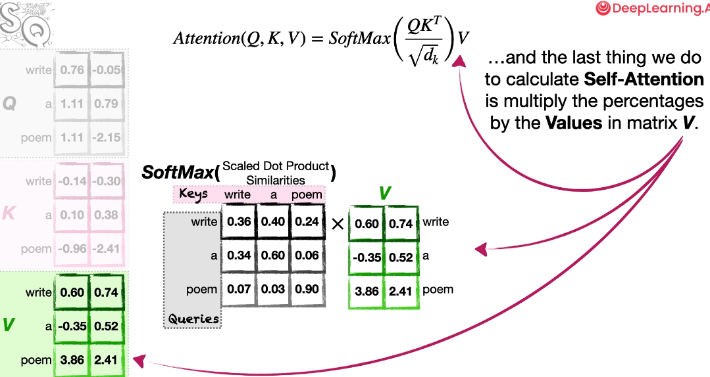

# The Matrix Math for Calculating Self-Attention

## The equation of Self-Attention

- Self-Attention은 입력 문장의 모든 단어들의 의미 유사도를 계산한다.
- 수식에 사용된 용어는 데이터베이스 용어에서 넘어온 것으로, 의미 유사도를 계산할 때 우리는 모든 단어의 Query와 Key로 Value를 계산한다. (마치 데이터베이스에 Query로 테이블의 Key 값으로 Value를 가져오는 것 처럼)

---

- Transformer는 Word Embeddings -> Positional Encodings -> Self-Attention을 진행
- 아래와 같이 각 단어의 인코딩 된 값을 쿼라 가중치와 행렬 연산을 진행한다. (Matrix Math)
- Transpose Symbol (전치): 행과 열의 위치를 바꾸는 것. MxN -> NxM
- 그렇게 Query, Key, Values의 가중치를 곱한 행렬값을 만들고 Self-Attention 수식으로 계산한다.

### 1. Dot product & Cosine Similarity

- 수식 계산시 K를 전치하여 계산하는데 이유는, 행렬곱이 제대로 계산하기 위해서이다.
- Dot Product(내적 또는 스칼라 곱): **두 벡터를 곱해서 하나의 숫자(스칼라)**를 만드는 연산

  - (0.76 · -0.14) + (-0.05 · -0.30) = - 0.09 -> 이 연산 자체를 Dot Product 라고 함
  - 곱하기를 나타내는 `·` 의로 생산 -> Dot Product...?
  - Dot products(unscaled measure of similarity)
    - 두 벡터를 곱해서 하나의 숫자 (내적 또는 스칼라곱)
    - 벡터의 길이(크기)를 고려하지 않은 유사도
    - 방향이 비슷해서 유사한 것인지, 아니면 그냥 둘 다 길이가 길어서 그런 것인지는 알 수 없음

- 결론적으로, 모든 가능한 Dot Product 값을 구하면서 계산은 끝이 난다.

### 2. the square root of d sub k

- Dot Product 값에 the square root of d sub k를 나눈다.
- d sub k는 Key의 차원수로, 예시에서는 각 토큰이 가지고 있는 Value의 수를 의미한다. 고로 2.
- 나눔으로써 벡터의 크기(scaled)가 있는 dot product가 생성
- 그러나 주의할 점은, 모든 경우에서 the square root of d sub k로 나눈다고 정해진 방식으로 dot product가 예쁘게 조정되지는 않는다. 그럼에도 나누는 이유는
  - 벡터 차원이 커질수록, 이 내적(dot product)은 평균적으로 커지는 경향이 있음
  - 숫자가 너무 커져서 softmax에 넣으면 gradient가 너무 작아지고 학습이 어려워짐
  - 따라서 이 내적 값을 적절히 줄여주기 위해서 the square root of d sub k로 나누는 것.
  - 정해진 공식이라기 보다는 실제 효용이 있는 방법으로, Transformer 논문의 저자도 이와 같이 설명한다.

### 3. softmax

- SoftMax로 각 토큰의 2번 값을 0~1 사이의 값으로 정규화해서 더함
- 정규화해서 더한 값의 합은 항상 1이며, 해석은 아래와 같다. write 토큰 기준, 각 토큰과 의미적 유사도를 가진다.
  - write 자기 자신은 0.36
  - a와는 0.40
  - poem 과는 0.24

### 4.

- 마지막으로 각 row에 Value의 행렬곱으로 곱하고, 그 값의 합은 역시나 1이다.
- 이를 통해 SoftMax 함수의 결과값은
- Softmax 결과는 각 단어가 다른 단어의 표현을 만들 때 얼마나 중요하게 반영돼야 하는지를 의미
- 이 결과값을 Self-Attention Score 라고 한다.

self-attention 수식이 굉장히 복잡해 보였을 수 있으나 결론은 아래와 같다.

- 각 토큰의 dot product(내적 연산) 값을 구하고
- 그 값을 the square root of d sub k로 나누어 내적 값을 줄여준다.
- 그 후 SoftMax 함수로 0~1 사이의 값으로 정규화 후 Value 값을 곱한다.
