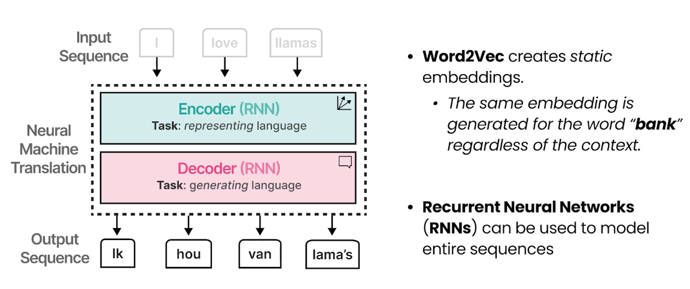
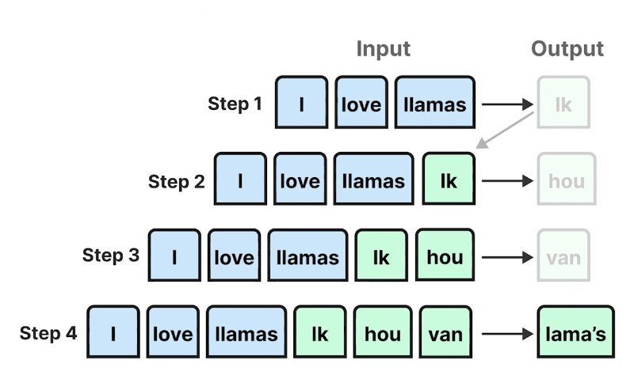
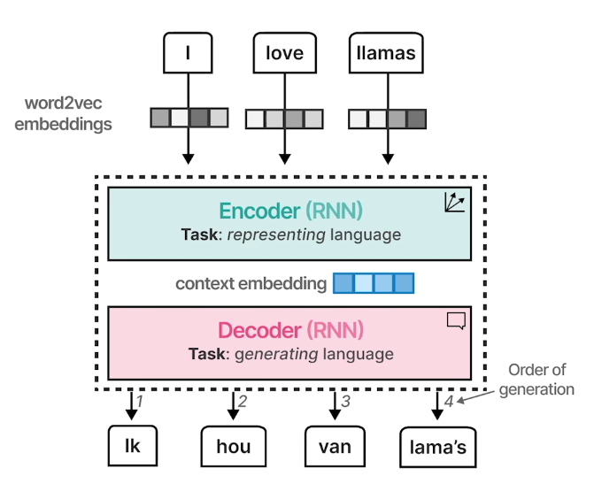
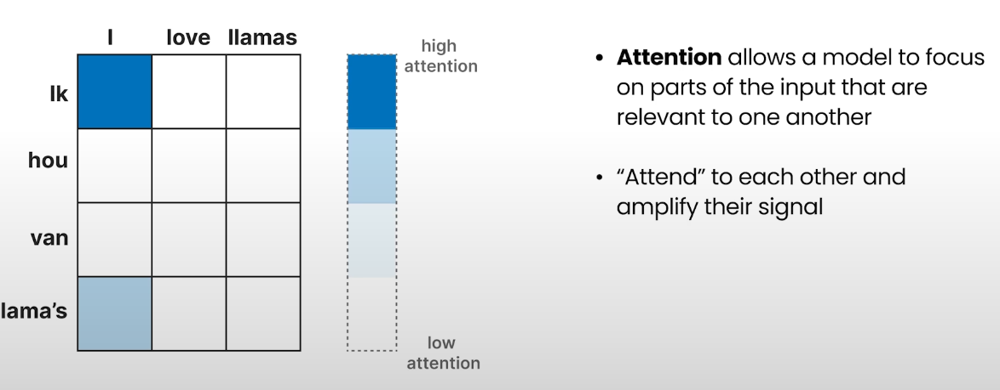
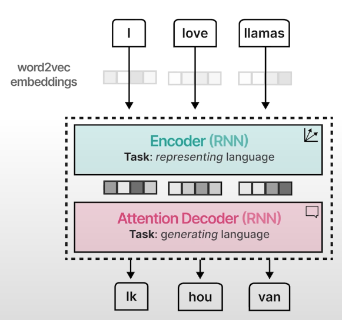

# Encoding & Decoding Context with Attention

## 1. Word2Vec의 한계와 문맥(Context) 인코딩

- Word2Vec 모델은 단어의 의미를 정적(static)으로만 파악함
  - 문맥에 따라 단어의 의미가 달라지는 것은 파악하지 못함
  - 예: '연기'라는 단어가 '연기를 피우다', '연기를 하다'처럼 문맥에 따라 의미가 다름
- 문맥에 따른 단어의 의미를 학습하기 위해 RNN(Recurrent Neural Networks) 기반의 Encoder-Decoder 구조를 사용
- 예시: 영어 문장을 독일어로 번역
  - Encoder: 입력 문장을 벡터로 변환
  - Decoder: 벡터화된 문장을 바탕으로 출력 문장 생성

---

## 2. Autoregressive Decoder와 번역 과정

- 대부분의 Decoder는 Autoregressive 방식(이전까지 생성된 출력을 기반으로 다음 출력을 생성) 사용
- Decoder는 각 스텝별로 토큰을 하나씩 생성하며, 이전에 생성된 토큰을 다음 스텝의 입력에 포함시킴
- 이 방식은 앞에서 만든 단어들을 보며 다음 출력을 생성하기 위함

---

## 3. Encoder-Decoder 구조의 단계별 설명

1. 문장을 토큰화
2. 토큰화된 문장을 Word2Vec 모델로 벡터화(각 단어의 정적 의미만 파악)
3. 각 임베딩 벡터는 Encoder에 입력되어 Context Embedding으로 변환(문맥 반영)
4. Context Embedding은 Decoder로 전달되어 Autoregressive하게 출력 토큰을 생성

- 이 방식은 각 토큰을 순차적으로 생성하므로 긴 문장이나 복잡한 문장에 한계가 있음

---

## 4. Attention 메커니즘의 도입

- 2014년 Attention 메커니즘이 도입되어 구조가 크게 변화함
- Attention을 통해 토큰화된 입력의 관계에 집중(focus)하여 각 토큰의 관계성을 강화

---

## 5. Attention의 동작 원리와 효과

- Attention mechanism을 Decoder에 적용하여, RNN이 입력 문장에서 어떤 단어에 집중해야 하는지 판단하는 attention score를 생성
- 이 score를 통해 입력 문장의 어떤 부분에 집중할지 결정하고, 그에 따라 다음 출력 단어를 생성
- Encoder에서는 문맥을 압축한 context embedding이 아닌, 입력 문장의 모든 hidden states(각 단어별 내부 벡터)를 Decoder로 전달
- Decoder는 attention mechanism을 통해 문장 전체를 분석하여 출력 토큰을 생성
- 이로써 모델이 중요한 단어에 집중할 수 있게 되었으나, 여전히 순차적 구조의 한계는 존재

