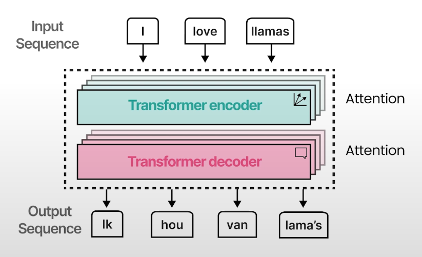
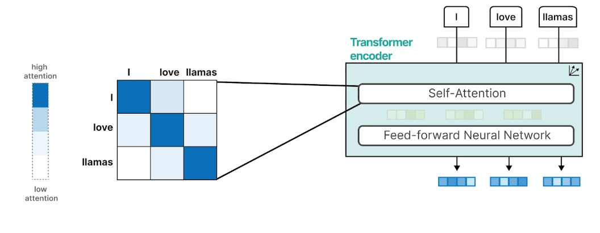
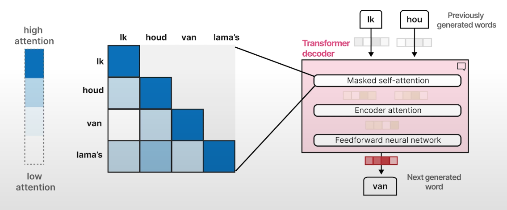
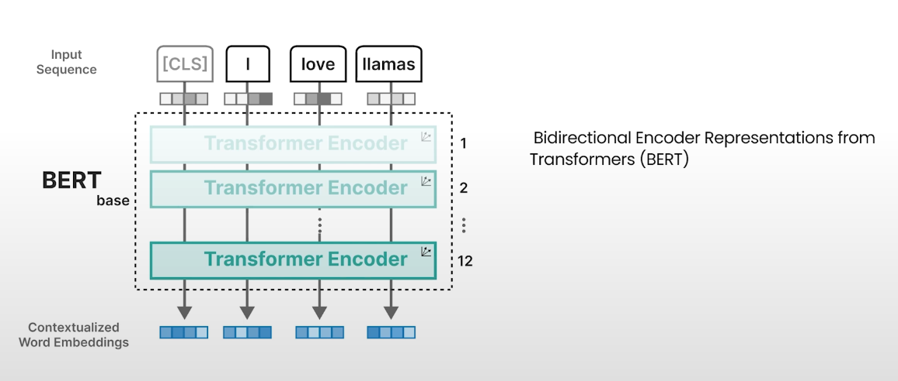
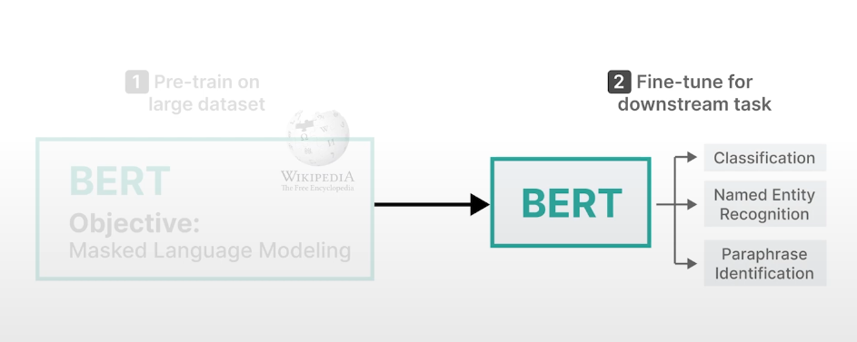
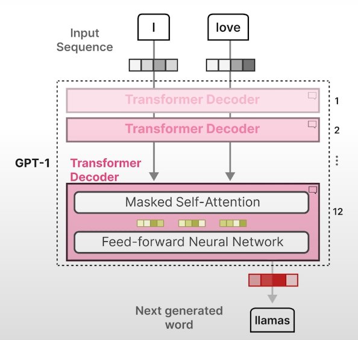
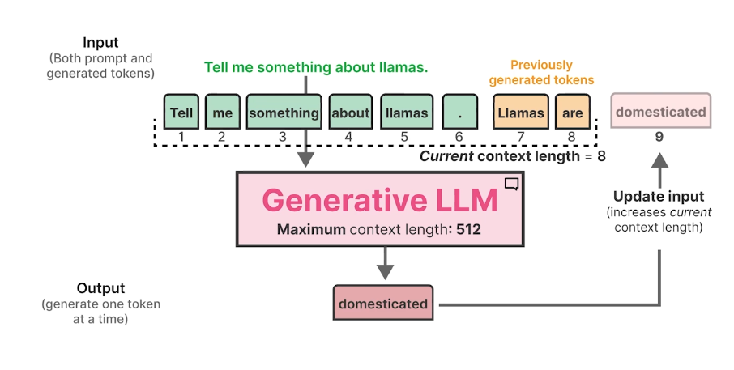
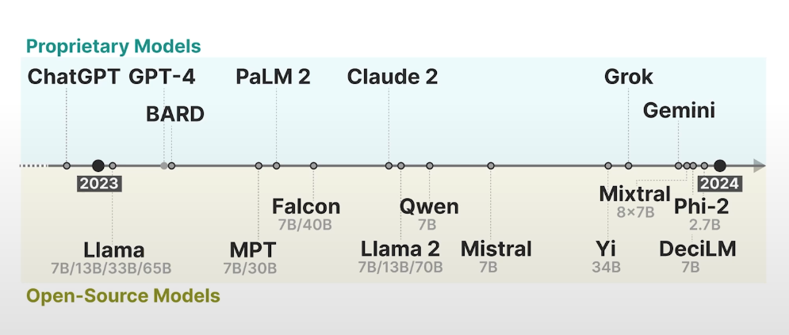

# Transformers와 현대 NLP 모델 정리

## 1. Transformer의 등장과 구조

- Attention mechanism을 통해 입력 문장에서 단어의 의미뿐 아니라 어떤 단어에 더 집중해야 하는지 파악 가능
- 기존 RNN 기반 모델의 한계(순차적 구조, hidden state의 한계)를 극복하기 위해 Transformer는 RNN 없이 오직 attention만으로 구성
- 병렬적으로 학습이 가능하며, encoder-decoder 구조를 가짐

---

## 2. Transformer Encoder의 동작 원리

1. 입력 문장을 토큰화하여 임베딩 벡터로 변환 (Word2Vec이 아닌 랜덤 초기화)
2. self-attention: 각 토큰의 임베딩 벡터가 문맥의 의미를 풍부하게 반영하도록 self-attention 수행
3. Feed-Forward Neural Network(FFN): self-attention 결과를 FFN에 전달하여 더 풍부한 임베딩 벡터 생성

---

## 3. Transformer Decoder의 동작 원리

- Decoder는 autoregressive하게 동작하며, masked self-attention을 통해 미래 단어를 보지 못하게 함
- encoder-decoder attention: encoder의 hidden states와 decoder의 중간 벡터를 결합해 context-aware representation 생성
- FFN을 통해 최종 출력 벡터 생성

---

## 4. BERT: Bidirectional Encoder Representations from Transformers

- BERT는 encoder only 모델로, 입력 문장의 임베딩에 특화
- 입력에 CLS 토큰을 추가하여 문장 전체를 대표하는 벡터로 사용
- Masked Language Modeling 기법으로 학습: 입력 문장 중 일부 토큰을 masking하고, 그 의미를 예측하도록 학습

---

## 5. Representation Model의 활용

1. Pre-train: 대규모 텍스트 데이터로 BERT를 사전학습
2. Fine-tune: 분류, 개체명 인식, 문장 유사도 판단 등 다양한 downstream task에 맞춰 파인튜닝

---

## 6. Generative Model (GPT 등)

- GPT는 Transformer의 decoder only 모델
- 입력 문장을 임베딩(랜덤 초기화) 후 여러 층의 decoder를 거쳐, 각 층에서 masked self-attention과 FFN을 통해 새로운 토큰을 생성

---

## 7. Context Length의 한계

- 모델이 한 번에 처리할 수 있는 토큰의 최대 길이(컨텍스트 길이)가 존재
- 디코더에서 autoregressive로 업데이트된 토큰도 최대 길이를 넘을 수 없음

---

## 8. 주요 LLM(대형 언어 모델) 비교

- 대표적인 상용/오픈소스 LLM의 계보와 발전 흐름

