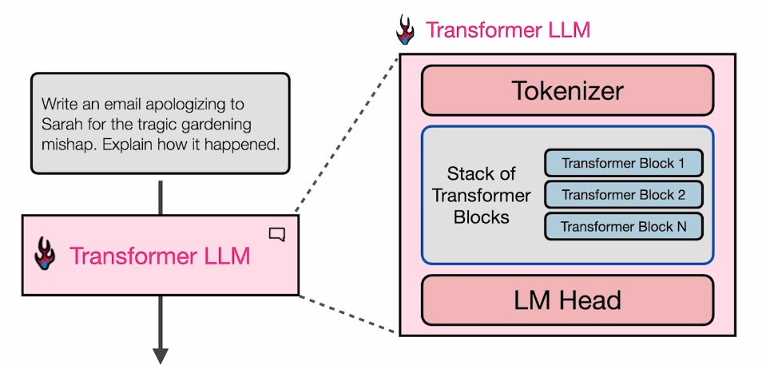
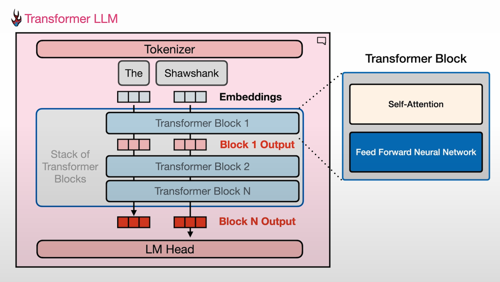
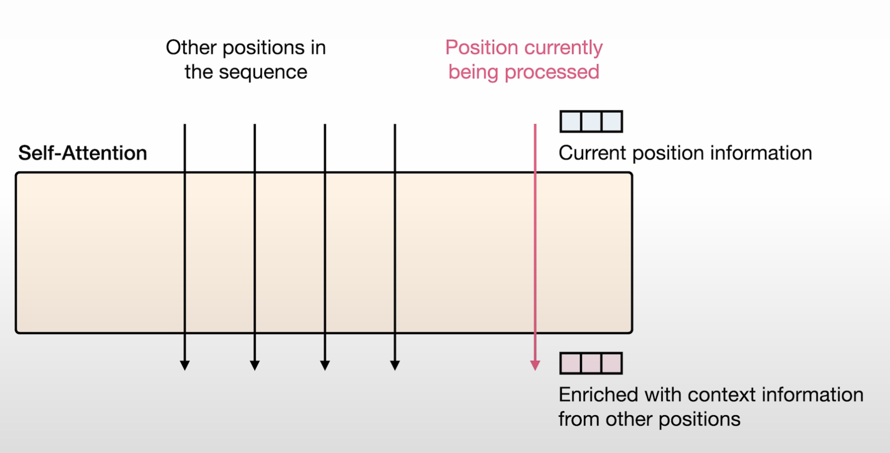

# Transformer LLM Architectural Overview

## 1. Transformer LLM의 주요 컴포넌트

- Transformer LLM은 크게 3가지 컴포넌트
- 로 구성됨
  1. Tokenizer: 입력 문장을 작은 청크(토큰)로 분해
  - 각 토큰에는 고유 식별자가 부여되고, 임베딩 벡터로 변환됨
  2. Stack of Transformer Blocks: 여러 개의 Transformer Block이 쌓여 있는 구조
  3. LM Head(Language Modeling Head): Transformer Blocks의 출력을 받아 다음 단어 생성을 위한 벡터값을 생성
  - LM Head에서 각 토큰의 확률을 계산하여 가장 높은 확률의 토큰을 출력
- 토큰 생성 과정에서 처음 생성된 토큰은 다시 transformer에 입력되어 반복(loop) 구조가 됨
- 두 번째부터는 KV caching을 통해 효율적으로 계산

---

## 2. Transformer Blocks의 구조와 역할

- Tokenizer를 통해 토큰화된 입력 문장은 임베딩 벡터로 변환되어 Transformer Blocks에 전달됨
- 각 Block은 Self-Attention과 Feed Forward Neural Network(FFN) 두 개의 층으로 구성
  - Self-Attention: 여러 단어의 관계를 이해
  - FFN: 각 벡터를 더 깊이 있게 처리하여 정보 확장
- 예시: "The shawshank"를 보고 영화 제목, 명사, 대문자로 시작 등 다양한 정보를 벡터 차원으로 확장

---

## 3. Self-Attention의 세부 동작

- Self-Attention은 다음과 같은 역할을 수행
  - Coreference Resolution(상호참조해결): 텍스트 내 반복적으로 등장하는 entity를 식별
    - 예: "Ana works at Google. She loves her job."에서 "She"와 "her"가 "Ana"를 가리키는 것
  - Relevance Scoring: 현재 토큰과 관련 있는 토큰인지 판단
  - Combining Information: 관련 있는 토큰끼리 정보를 합쳐 출력 토큰 생성
- Self-Attention은 문장 내 각 위치의 정보를 다른 위치의 정보와 결합하여 문맥을 풍부하게 만듦

