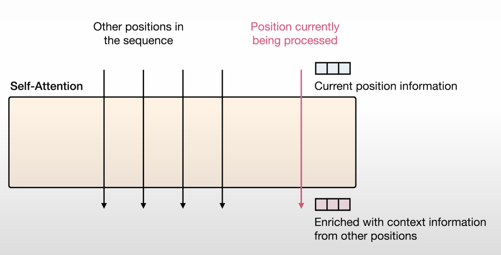
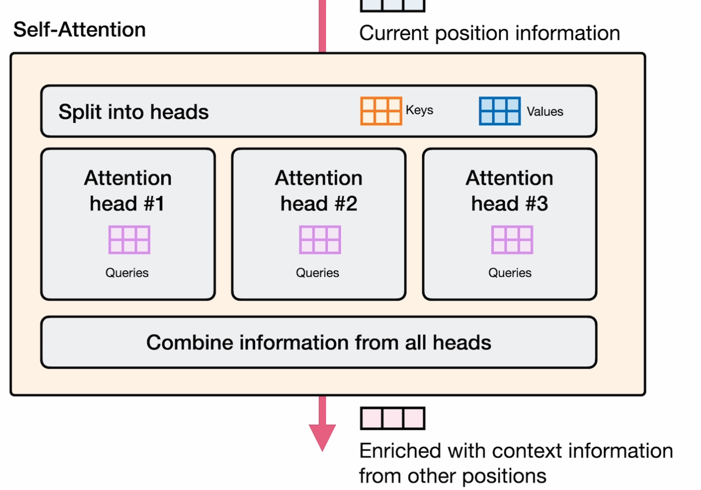

# Self-Attention과 Transformer Block의 세부 구조

## 1. Transformer Block의 구조

- Tokenizer를 통해 토큰화된 입력 문장은 임베딩 벡터로 변환되어 Transformer Blocks에 전달됨
- 각 Block은 Self-Attention과 Feed Forward Neural Network(FFN) 두 개의 층으로 구성
- Self-Attention은 단어 간의 관계를 이해하고, FFN은 각 벡터를 더 깊이 있게 처리함
- 예시: "The shawshank"를 보고 영화 제목, 명사, 대문자로 시작 등 다양한 정보를 벡터 차원으로 확장

---

## 2. Self-Attention의 역할과 동작

- Self-Attention은 Coreference Resolution(상호참조해결), Relevance Scoring, Combining Information 등 다양한 역할을 수행
- 문장 내 각 위치의 정보를 다른 위치의 정보와 결합하여 문맥을 풍부하게 만듦

---

## 3. Self-Attention의 내부 연산: Relevance Scoring

- Self-Attention은 Query, Key, Value 세 가지 Projection Matrices로 구성
- 현재 토큰이 다른 토큰과 얼마나 관련 있는지 수치화하여 relevance score를 계산
- 각 스코어와 벡터 값을 곱해 가중치 값을 얻음

---

## 4. Self-Attention의 가중치 적용 예시

- 각 토큰의 relevance score와 value를 곱해 weighted value를 얻음

---

## 5. Multi-Head Attention(MHA)와 병렬 처리

- Transformer에서는 한 문장의 토큰들이 병렬적으로 계산됨
- Multi Query Attention: 여러 개의 Query에 대해 하나의 Key/Value를 공유하여 효율적으로 attention 수행
- Grouped Query Attention: 여러 쿼리를 그룹 단위로 묶어 Key/Value를 공유

---

## 6. Sparse Attention의 개념과 방식

- Self-Attention의 계산량을 줄이기 위한 최적화 기법
- 모든 토큰 간 연산을 하지 않고, 일부 중요한 토큰만 골라서 attention 수행
- Local, Strided, Global, Random, Learned Pattern 등 다양한 방식 존재

---

## 7. Transformer Block의 주요 하이퍼파라미터

- Layers: Transformer Block 개수
- Model Dimension, FFN Dimension: 벡터 차원수
- Attention Heads: 헤드 개수
- Key-Value Heads: 그룹 개수
- Vocabulary Size: 토큰 사이즈

