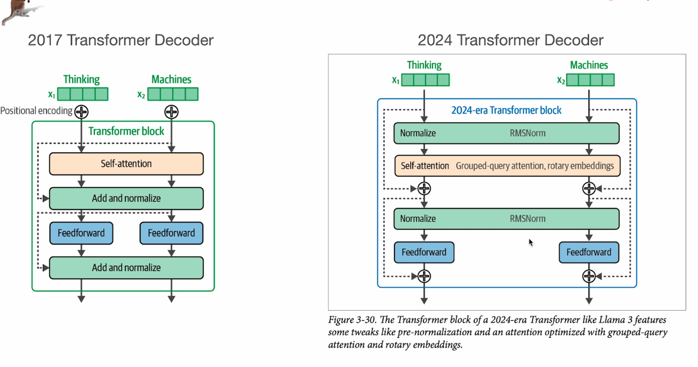
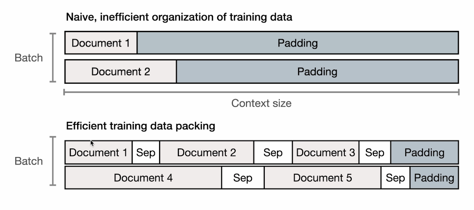

# 최신 트랜스포머 구조의 변화

## 1. 트랜스포머 구조의 변화

- Positional Encoding: 더 이상 첫 단계에서만 하지 않고, Self-Attention layer에서 수행 (rotary embeddings)
- Grouped-query attention: 속도와 메모리 효율을 높이기 위한 구조
- Residual Connection: 입력을 그대로 출력에 더해 정보 손실을 막고, 모델이 학습하기 쉽게 만듦 (self-attention과 FFN 뒤에 발생)

---

## 2. Training LLMs: 데이터 효율과 포지셔널 임베딩

- Rotary Positional Embedding(RoPE): 최신 트랜스포머에서 위치 정보를 자연스럽고 연속적으로 인코딩하는 방식
- Naive 방식: 각 문서를 별도 입력으로 처리, 짧은 문서는 padding으로 채워져 비효율적
- Packing 방식: 여러 문서를 하나의 긴 시퀀스로 이어서 context window를 최대한 채움, [SEP] 토큰으로 구분
- Rotary embedding 덕분에 위치 정보가 문서마다 초기화되지 않고 전체 토큰에 일관되게 적용 가능

